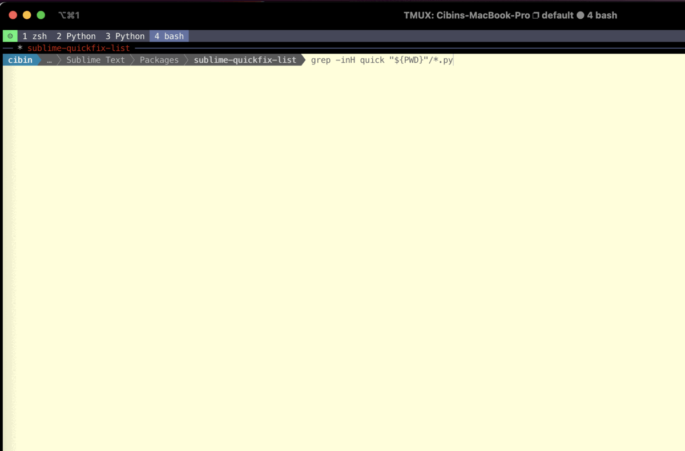

# quickfix_list

Inspired by vim [quickfix and location list](https://freshman.tech/vim-quickfix-and-location-list/), 
provides an easy way to **navigate back and forth through list of files** populated by **grep**, **fzf**, search results etc



- `Quickfix List: Next match`: Go to next match
- `Quickfix List: Open quickfix list file`: Open the custom file

## How to Use
- Save/open `QUICKFIX_CUSTOM_FILE`. By default it is located at `/tmp/sublime_quickfix_list.txt`
```
grep -inH quick "${PWD}"/*.py > /tmp/sublime_quickfix_list.txt
 ```
- From Command palette, run `Quickfix List: Next match`
## Key bindings
No default keybinding is provided. Use below sample as necessary
```
[
    { "keys": ["ctrl+r"], "command": "quickfix_list" }
]
```
## How to Install

### Install with [Package Control](https://packagecontrol.io/installation)
todo
### OR Install manually
copy this repository into the [Packages](https://docs.sublimetext.io/guide/extensibility/packages.html#package-locations-and-abbreviations) directory
1. cd into the packages directory. 
2. clone
  ```sh
  $ git clone git@github.com:cibinmathew/sublime_quickfix_list.git
  ```

### TODOs
- [ ] Submit to package control channel
- [ ] Support relative path
- [ ] Support search results panel
- [ ] Add FAQ section to readme


### Motivation

[VIM quickfix list](https://freshman.tech/vim-quickfix-and-location-list/)
### Contributors

<a href="https://github.com/cibinmathew/sublime-alter-text/graphs/contributors">
  
</a>

### License

[MIT License](LICENSE)
